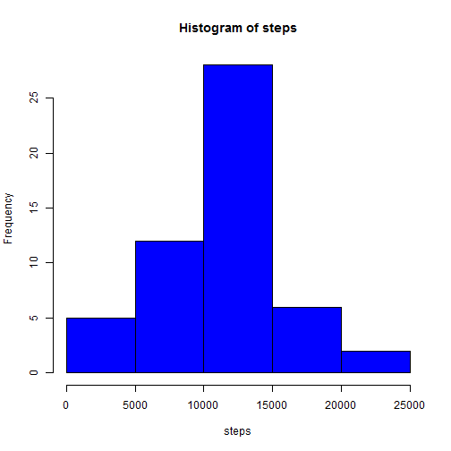
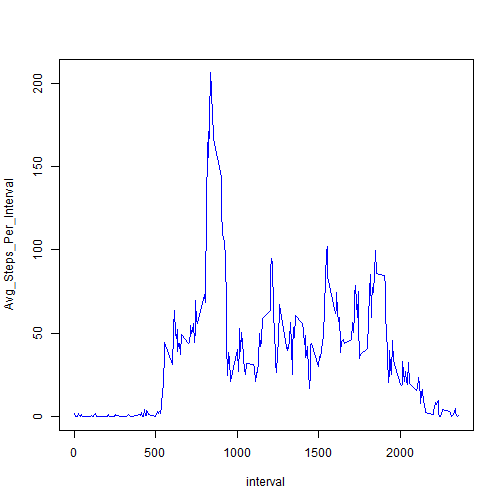
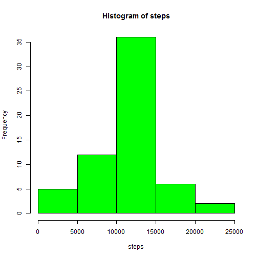
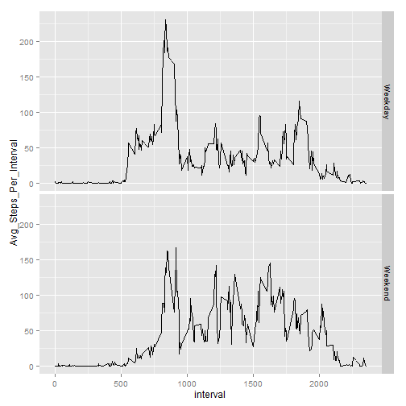

---
title: "Reproducible Research: Peer Assessment 1"
output: 
  html_document:
    keep_md: true
---

### Loading and preprocessing the data


```r
data<-read.csv("activity.csv")  ##Reading data from the work directory
data[,2]<-as.Date(data$date)    ##Changing the date format
```

### Mean and Median of total number of steps taken per day

Missing values are ignored for the follwoing analysis. Data frame df1 is created without missing values


```r
df1<-na.omit(data) ##Missing values are removed
```

####1) Total # of steps per day is calculated below using the dplyr package in R. Output is saved in dataframe total_steps


```r
library(dplyr)
```

```
## 
## Attaching package: 'dplyr'
## 
## The following objects are masked from 'package:stats':
## 
##     filter, lag
## 
## The following objects are masked from 'package:base':
## 
##     intersect, setdiff, setequal, union
```

```r
total_steps<-df1 %>% group_by(date) %>% summarise(steps = sum(steps)) ##Calculating total steps per day
```

####2) Histogram of the total steps taken per day is plotted below:


```r
with(total_steps,hist(steps,col="blue"))
```

 

####3) Mean and Median calculation:


```r
Mean<-mean(total_steps$steps)      ##Calculating Mean
Median<-median(total_steps$steps)  ##Calculating Median
```
Mean of total # of steps per day is:

```r
Mean
```

```
## [1] 10766.19
```
Median of the total # of steps per day is:

```r
Median
```

```
## [1] 10765
```

### Average daily activity pattern

Missing values are ignored in this portion of analysis too. Dataframe, "df1" , created earlier are used for the following 

#### 1)Time series plot (5-minture interval Vs. Avg steps averaged accrosed the days)

Avg. # of steps (averaged accross the days) per interval is saved in the dataframe "avg_stps". Calculated date is used to create the time series plot.


```r
avg_stps<-df1 %>% group_by(interval) %>% summarise(Avg_Steps_Per_Interval=mean(steps)) ## Avg. steps per Interval,accross days
with(avg_stps,plot(interval,Avg_Steps_Per_Interval,type="l",col="blue"))
```

 

#### 2) 5-minute interval with max. avg steps

```r
max<-filter(avg_stps,Avg_Steps_Per_Interval==max(avg_stps$Avg_Steps_Per_Interval)) ##getting the row with max. Avg. Steps, averaged across the days
Interval<-max$interval ##Interval with the max. # of steps
```
5-minute interval, on average across all days, that contains maximum # of steps is:

```r
Interval
```

```
## [1] 835
```

### Imputing missing values

In this portion of analysis, number of rows with missing values are calculated, missing values in the original dataset are assigned values and a new dataset, df_new, is created with the missing data filled in.

#### 1) Number of rows with missing value


```r
m1<-which(is.na(data$steps))  ## this contains the row number for all missing data; used later in the calcuations
rows<-length(which(is.na(data$steps))) ## number of rows with missing data
```

Number of rows with missing data is:

```r
rows
```

```
## [1] 2304
```
#### 2) Strategy to assign values to missing data

The dataframe "avg_stps"" is used to assign values to missing data. This dataset contains the avg. # of steps, averaged across all days, for each interval. Thus for any missing data, the avg. # of steps for the interval is assigned as the value.

#### 3) New dataset with the missing date filled in based on the above mentioned strategy


```r
## rows - total number of rows with missing value
## m1 - all the row numbers for the missing data
df_new<-data   ##copying original data to a new dataframe, df_new. This still has missing values.
for(i in 1:rows) 
    {
        a1<-df_new[m1[i],3]                    ## Finding the interval for the missing data
        a2<-avg_stps[avg_stps$interval==a1,2]  ## Finding avg. # of steps,from avg_stps, for the interval that is missing data
        df_new[m1[i],1]=a2      ## Assigning the value for missing data as the avg. # of steps for the respective interval
    }
##df_new is the new dataset with no missing values
## num of rows with missing values in new datset should be zero; it is proven in the below calculation:
length(which(is.na(df_new$steps)))   ## this output will be zero
```

```
## [1] 0
```

#### 4) Plotting histogram for total # of steps per day and finding Mean & Median for the new dataset


```r
ts<-df_new %>% group_by(date) %>% summarise(steps = sum(steps)) ##Calculating total steps per day for new dataset
with(ts,hist(steps,col="green"))  ##Histogram for total steps per day for new dataset
```

 


```r
Mean1<-mean(ts$steps)      ##Calculating Mean of total steps per day for new dataset
Median1<-median(ts$steps)  ##Calculating Median of total steps per day for new dataset
```
Mean of total # of steps per day for new dataset is:

```r
Mean1
```

```
## [1] 10766.19
```
Median of the total # of steps per day for new dataset is:

```r
Median1
```

```
## [1] 10766.19
```

Comparing the results with the previous calculations, Mean for both cases was the same. Median is different in both cases.
In the new dataset, with missing data filled in, mean and median are the same. This indicates that the data is evenly divided 
around the mean.

### Activity patterns between weekdays and weekend

New dataset with missing values filled in are used for this portion of analysis

#### 1) Adding a new column , day, in the dataset that show whether a day is weekend or weekday

Dataset created after adding the new column, day, is saved as df_new1


```r
df_new1<-mutate(df_new,day=ifelse(weekdays(date)=="Saturday" | weekdays(date)== "Sunday","Weekend","Weekday"))
   ## Adding a new column, "day", and saving the output in new dataframe "df_new1"
```

#### 2) Panel plot containing time series plot

This plots 5-min interval vs. the avg # of steps, averaged across all weekend days or weekday days


```r
df_new2<-df_new1 %>% group_by(interval,day) %>% summarise(Avg_Steps_Per_Interval=mean(steps))
        ## creating a dataframe df_new2, that has avg steps per interval for weekend and weekday
library(ggplot2)
qplot(interval,Avg_Steps_Per_Interval,data=df_new2,facets=day~.,geom="line")
```

 

```r
  ##Creating the time series plot for interval vs. avg steps per day for weekends and weekdays
```


